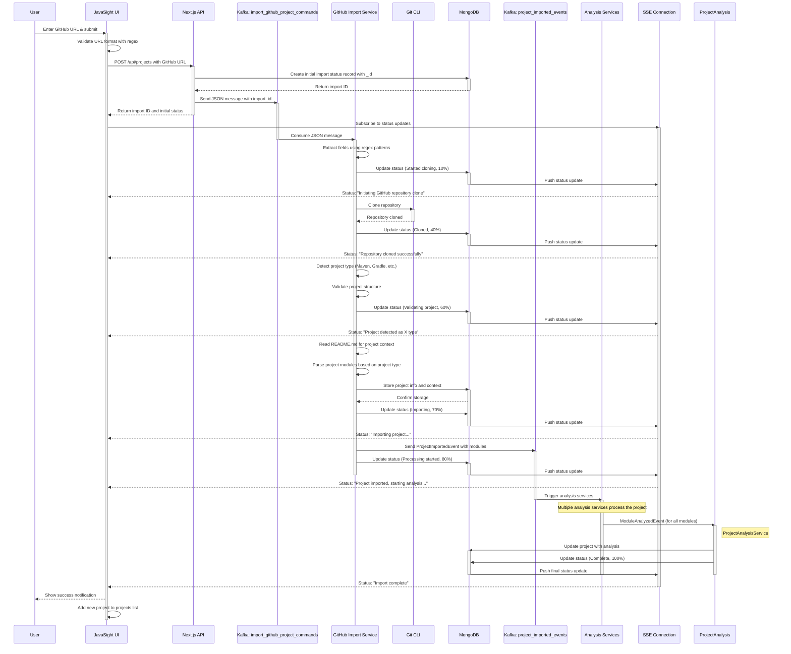

# Implementation Plan: GitHub URL Project Import for JavaSight

## 1. Frontend Components

### 1.1. "Add Project" Button
- Add a prominent "+ Add Project" button to the homepage header
- Position it near the "Java Projects" heading for visibility

### 1.2. GitHub Import Modal
- Create a new `ImportGithubProjectModal.tsx` component with:
  - Simple, elegant form layout with clear instructions
  - GitHub URL input field with validation
  - Project name field (auto-populated from repository name)
  - Import button with loading state
  - Visual progress indicator for import stages

### 1.3. Progress Tracking Component
- Create a `ProjectImportProgress.tsx` component that shows:
  - Step-by-step progress indicators (Cloning, Analyzing, Processing)
  - Real-time status updates from the backend
  - Success confirmation or error details

## 2. Backend API Additions

### 2.1. Project Import API Endpoint
- Update `/api/projects/route.ts` to add POST method that accepts:
  - GitHub repository URL
  - Optional custom project name

### 2.2. GitHub URL Validation
- Validate GitHub URLs for correct format using regex pattern
- Repository accessibility is checked during the clone operation
- Project type is detected and validated after successful cloning (Maven, Gradle, Ant, SBT, or plain Java)

## 3. Backend Service Modifications

### 3.1. Kafka Protocol Extension
- Add new message type in `kafka.proto`:
  ```proto
  message ImportGithubProjectCommand {
    string project_name = 1;
    string github_url = 2;
    string project_context = 3;
    int64 timestamp = 4;
  }
  ```
- Note: The import_id is not part of the proto definition but is extracted from the JSON message in the service implementation

### 3.2. Add New Kafka Topic
- Add in `KafkaTopic.scala`:
  ```scala
  case object ImportGithubProjectCommands extends KafkaTopic { 
    override def toString = "import_github_project_commands" 
  }
  ```

### 3.3. GitHub Project Import Service
- Create `GithubProjectImportService.scala` to:
  - Clone public GitHub repositories
  - Detect and validate project type (Maven, Gradle, Ant, SBT, or plain Java)
  - Send progress updates via status collection with detailed progress percentages
  - Handle the project import process
  - Report detailed errors for invalid repositories
  - Extract fields from JSON messages using regex patterns
  - Read README.md content from cloned repository to use as project context if available
  - Parse project modules based on project type:
    - Maven: Parse modules from pom.xml
    - Gradle: Parse modules from settings.gradle or settings.gradle.kts
    - Other project types: Treat as single module

## 4. Progress Tracking System

### 4.1. Status Collection in MongoDB
- Add a new `project_import_status` collection to track:
  - Current import stage
  - Progress percentage
  - Status messages
  - Error details (if any)

### 4.2. Server-Sent Events for Progress Updates
- Implement SSE endpoint for real-time progress:
  ```
  /api/projects/import/status/:importId
  ```

## 5. Implementation Steps (Frontend)

1. Add modal trigger button to homepage
2. Create modal component with form
3. Implement GitHub URL validation with regex pattern
4. Add form submission handler to call API
5. Create progress tracking UI with stages visualization
6. Implement SSE client for real-time updates
7. Handle success and error states with appropriate UI feedback

## 6. Implementation Steps (Backend)

1. Update Kafka protocol definition
2. Create new Kafka topic for GitHub imports
3. Implement GitHub project import service with:
   - Git command execution for cloning
   - Repository validation
   - Progress tracking and reporting
   - Error handling
4. Integrate with existing project processing pipeline
5. Add status tracking collection and API endpoints

## 7. Error Handling

- Validate GitHub URL format before submission using regex pattern in frontend
- Check repository accessibility during the clone operation
- Detect and validate project type after successful cloning
- Clean up partial clones on failure
- Update import status with detailed error messages
- Provide clear error messages for each failure scenario:
  - "Invalid GitHub URL format"
  - "Git clone failed with exit code X" (when repository is not found or not public)
  - "Invalid pom.xml file: [specific XML parsing error]" (for Maven projects)
  - "Unable to determine project type. No recognized build files found and no Java files detected."
  - Project-type specific validation errors

## 8. Testing Plan

- Test public GitHub repositories with various structures
- Verify handling of non-Maven repositories
- Test progress updates for large repositories
- Ensure UI gracefully handles all error cases

## 9. Process Flow Diagram



This diagram illustrates the end-to-end flow of the GitHub import process, from user input to final project analysis.
